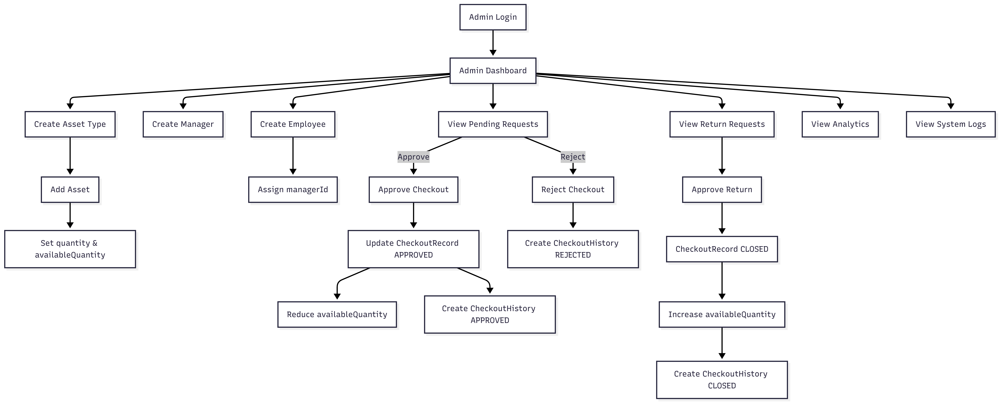
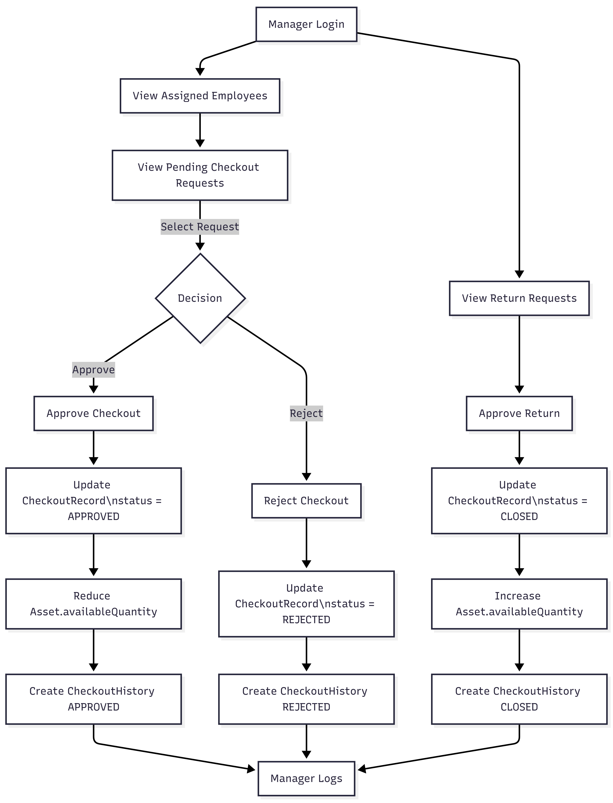
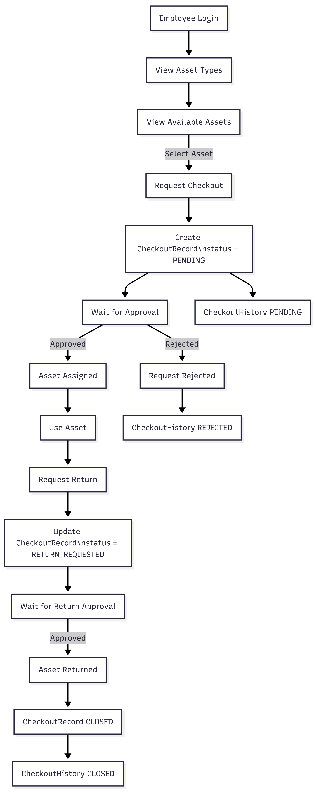

# AssetHub – Complete Route & API Documentation (From Source Code)

Tech Stack:

* Next.js (App Router)
* NextAuth
* Prisma + PostgreSQL
* Role-based access (Employee, Manager, Admin)

---

## 1. Application Routes (`src/app`)

### 1.1 Public Routes

| Route    | Description                       |
| -------- | --------------------------------- |
| `/`      | Landing / Home page               |
| `/login` | User login (NextAuth credentials) |
|          |                                   |

---

### 1.2 Authenticated Routes

| Route                   | Roles | Description                  |
| ----------------------- | ----- | ---------------------------- |
| `/dashboard`            | All   | User dashboard               |
| `/asset-types`          | All   | List of asset types          |
| `/asset-types/[typeId]` | All   | Assets under a specific type |

---

### 1.3 Admin Routes

| Route                | Description        |
| -------------------- | ------------------ |
| `/admin`             | Admin dashboard    |
| `/admin/assets`      | Manage assets      |
| `/admin/asset-types` | Manage asset types |
| `/admin/managers`    | Manage managers    |
| `/admin/employees`   | Manage employees   |
| `/admin/analytics`   | System analytics   |

Protected using `middleware.ts` + NextAuth JWT role check.

---

### 1.4 Manager Routes

| Route                | Description             |
| -------------------- | ----------------------- |
| `/manager`           | Manager dashboard       |
| `/manager/employees` | Employees under manager |
| `/manager/logs`      | Manager activity logs   |

---

## 2. API Routes (`src/app/api`)

**All backend APIs in this project are implemented exclusively inside the ****``**** folder** using **Next.js App Router Route Handlers** (`route.ts`).

There are **no legacy ****``**** routes** in this codebase.

### Key Characteristics

* Each folder inside `src/app/api` maps directly to a URL path
* `route.ts` files define HTTP methods (`GET`, `POST`, `PUT`, `DELETE`)
* APIs are **server-only** and never bundled to the client
* Authentication is handled via **NextAuth session / JWT**
* Role checks (Admin / Manager / Employee) are enforced inside handlers or middleware

All APIs return **JSON responses** and are consumed by:

* Server Actions
* Server Components
* Client Components (via fetch)

---

## 2.1 Asset Type APIs

### `GET /api/asset-types`

Fetch all asset types.

---

### `GET /api/asset-types/by-type/[typeId]`

Fetch assets belonging to a specific asset type.

---

### `POST /api/admin/add-type`

Create a new asset type.

**Body**

```json
{
  "name": "Laptop",
  "description": "Company laptops"
}
```

Admin only.

---

### `DELETE /api/admin/delete-type/[typeId]`

Delete an asset type by ID.

---

## 2.2 Asset APIs

### `GET /api/admin/get-assets`

Fetch all assets (Admin view).

---

### `POST /api/admin/add-assets`

Create a new asset.

**Body**

```json
{
  "label": "Dell Latitude",
  "typeId": "uuid",
  "status": "AVAILABLE",
  "quantity": 10
}
```

---

### `PUT /api/admin/update-asset/[assetId]`

Update asset details.

---

### `DELETE /api/admin/delete-asset/[assetId]`

Delete an asset.

---

## 2.3 Manager APIs

### `GET /api/admin/manager`

Fetch all managers.

---

### `POST /api/admin/manager/create`

Create a new manager.

---

### `PUT /api/admin/manager/[managerId]/edit`

Update manager details.

---

### `DELETE /api/admin/manager/delete/[managerId]`

Delete a manager.

---

### `POST /api/admin/manager/transfer`

Transfer employees from one manager to another.

---

## 2.4 Employee APIs

### `GET /api/admin/get-employee`

Fetch all employees (Admin).

---

### `POST /api/user/create-employee`

Create a new employee.

---

### `GET /api/user/get-employee`

Fetch logged-in employee profile.

---

### `PUT /api/user/handle-employee/[employeeId]`

Activate / deactivate / update employee.

---

### `PUT /api/user/update-profile`

Update logged-in user profile.

---

## 2.5 Checkout & Asset Assignment APIs

### `GET /api/checkout/pending`

Fetch pending asset checkout requests.

---

### `GET /api/checkout/history`

Checkout history for logged-in user.

---

### `POST /api/checkout/approve/[recordId]`

Approve checkout request.

---

### `POST /api/checkout/cancel/[recordId]`

Cancel checkout request.

---

### `POST /api/checkout/reject/[recordId]`

Reject checkout request.

---

### `POST /api/checkout/reject/available/[recordId]`

Reject and mark asset as available.

---

## 2.6 Asset Return APIs

### `POST /api/checkout/return/request/[recordId]`

Request asset return.

---

### `POST /api/checkout/return/approve/[recordId]`

Approve asset return.

---

### `POST /api/checkout/return/cancel/[recordId]`

Cancel return request.

---

### `POST /api/checkout/return/close/[recordId]`

Close return workflow.

---

## 2.7 Analytics & Logs

### `GET /api/admin/analytics`

System-wide analytics (assets, usage, users).

---

### `GET /api/admin/check-logs`

Audit and system logs.

---

### `GET /api/user/manager-logs`

Manager-specific activity logs.

---

## 3. Middleware (`src/middleware.ts`)

### Purpose

* Protect authenticated routes
* Enforce role-based access

### Behavior

* Redirects unauthenticated users to `/login`
* Blocks non-admin access to `/admin/*`
* Uses NextAuth JWT token (`token.role`)

---

## 4. Role Permissions Summary

| Role     | Capabilities                                 |
| -------- | -------------------------------------------- |
| Employee | View assets, request checkout, return assets |
| Manager  | Approve/reject requests, view team           |
| Admin    | Full system control                          |

---

## 5. Notes

* All APIs use Prisma for DB access
* Sensitive data handled server-side only
* Session stored in HTTP-only cookies

---

**Source:** Generated from uploaded `src.zip` (validated against `src/app/api` folder) **Owner:** AssetHub Engineering

---

## 6. API Folder Structure → Route Mapping (Authoritative)

Below is the **authoritative mapping** derived directly from the `src/app/api` directory. Every backend endpoint in AssetHub exists here.

```
src/app/api
├── admin
│   ├── add-assets/route.ts           → POST   /api/admin/add-assets
│   ├── add-type/route.ts             → POST   /api/admin/add-type
│   ├── delete-asset/[assetId]/route.ts → DELETE /api/admin/delete-asset/:assetId
│   ├── delete-type/[typeId]/route.ts → DELETE /api/admin/delete-type/:typeId
│   ├── get-assets/route.ts           → GET    /api/admin/get-assets
│   ├── manager
│   │   ├── route.ts                  → GET    /api/admin/manager
│   │   ├── create/route.ts           → POST   /api/admin/manager/create
│   │   ├── delete/[managerId]/route.ts → DELETE /api/admin/manager/delete/:managerId
│   │   ├── edit/[managerId]/route.ts → PUT    /api/admin/manager/:managerId/edit
│   │   └── transfer/route.ts         → POST   /api/admin/manager/transfer
│   ├── get-employee/route.ts         → GET    /api/admin/get-employee
│   ├── analytics/route.ts            → GET    /api/admin/analytics
│   └── check-logs/route.ts           → GET    /api/admin/check-logs
│
├── asset-types
│   ├── route.ts                      → GET    /api/asset-types
│   └── by-type/[typeId]/route.ts     → GET    /api/asset-types/by-type/:typeId
│
├── checkout
│   ├── pending/route.ts              → GET    /api/checkout/pending
│   ├── history/route.ts              → GET    /api/checkout/history
│   ├── approve/[recordId]/route.ts   → POST   /api/checkout/approve/:recordId
│   ├── cancel/[recordId]/route.ts    → POST   /api/checkout/cancel/:recordId
│   ├── reject/[recordId]/route.ts    → POST   /api/checkout/reject/:recordId
│   ├── reject/available/[recordId]/route.ts → POST /api/checkout/reject/available/:recordId
│   └── return
│       ├── request/[recordId]/route.ts → POST /api/checkout/return/request/:recordId
│       ├── approve/[recordId]/route.ts → POST /api/checkout/return/approve/:recordId
│       ├── cancel/[recordId]/route.ts  → POST /api/checkout/return/cancel/:recordId
│       └── close/[recordId]/route.ts   → POST /api/checkout/return/close/:recordId
│
├── user
│   ├── create-employee/route.ts      → POST   /api/user/create-employee
│   ├── get-employee/route.ts         → GET    /api/user/get-employee
│   ├── handle-employee/[employeeId]/route.ts → PUT /api/user/handle-employee/:employeeId
│   ├── update-profile/route.ts       → PUT    /api/user/update-profile
│   └── manager-logs/route.ts         → GET    /api/user/manager-logs
│
└── auth
    └── [...nextauth]/route.ts         → GET/POST /api/auth/*
```


## Admin Flow Diagram


## Manager Flow Diagram


## Employee Flow Diagram


## ER Diagram

